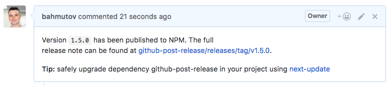

# github-post-release

> Forms release changelog and posts a note to each referenced issues after semantic release publishes a new module version

[![NPM][npm-icon] ][npm-url]

[![Build status][ci-image] ][ci-url]
[![semantic-release][semantic-image] ][semantic-url]
[![js-standard-style][standard-image]][standard-url]

## Problem

When publishing new version of your NPM package, it would be nice to comment
on each GitHub issue referenced by the semantic commits, letting the user
know that the fix / feature was published.

This module works as a [semantic-release][sem] [generate notes][gen] plugin.
It both comments on referenced issues and returns the changelog to be
posted on GitHub. Each issue will get a comment like this
([example](https://github.com/bahmutov/github-post-release/issues/8#issuecomment-313786374))



[sem]: https://github.com/semantic-release/semantic-release
[gen]: https://github.com/semantic-release/semantic-release#generatenotes

## Install and use

Requires [Node](https://nodejs.org/en/) version 6 or above.

```sh
npm install --save-dev github-post-release
```

The `postinstall` script will automatically set this module to be the
`generateNotes` plugin for the release. If you want you can do this manually:

```json
{
  "release": {
    "generateNotes": "github-post-release"
  }
}
```

## Debug

To see more log messages, run this plugin with `DEBUG=github-post-release`
flag. You can even demo the plugin locally (without actual GitHub updates)
using `npm run demo`.

## Related

It was inspired by [semantic-release-github-notifier][notifier],
[release-notes-generator][notes-generator] and uses
[conventional-changelog][conventional-changelog] to generate changelog text
after commenting on issues.

[notifier]: https://github.com/gitter-badger/semantic-release-github-notifier
[notes-generator]: https://github.com/semantic-release/release-notes-generator/
[conventional-changelog]: https://github.com/conventional-changelog/conventional-changelog#readme

### Small print

Author: Gleb Bahmutov &lt;gleb.bahmutov@gmail.com&gt; &copy; 2017

* [@bahmutov](https://twitter.com/bahmutov)
* [glebbahmutov.com](https://glebbahmutov.com)
* [blog](https://glebbahmutov.com/blog)

License: MIT - do anything with the code, but don't blame me if it does not work.

Support: if you find any problems with this module, email / tweet /
[open issue](https://github.com/bahmutov/github-post-release/issues) on Github

## MIT License

Copyright (c) 2017 Gleb Bahmutov &lt;gleb.bahmutov@gmail.com&gt;

Permission is hereby granted, free of charge, to any person
obtaining a copy of this software and associated documentation
files (the "Software"), to deal in the Software without
restriction, including without limitation the rights to use,
copy, modify, merge, publish, distribute, sublicense, and/or sell
copies of the Software, and to permit persons to whom the
Software is furnished to do so, subject to the following
conditions:

The above copyright notice and this permission notice shall be
included in all copies or substantial portions of the Software.

THE SOFTWARE IS PROVIDED "AS IS", WITHOUT WARRANTY OF ANY KIND,
EXPRESS OR IMPLIED, INCLUDING BUT NOT LIMITED TO THE WARRANTIES
OF MERCHANTABILITY, FITNESS FOR A PARTICULAR PURPOSE AND
NONINFRINGEMENT. IN NO EVENT SHALL THE AUTHORS OR COPYRIGHT
HOLDERS BE LIABLE FOR ANY CLAIM, DAMAGES OR OTHER LIABILITY,
WHETHER IN AN ACTION OF CONTRACT, TORT OR OTHERWISE, ARISING
FROM, OUT OF OR IN CONNECTION WITH THE SOFTWARE OR THE USE OR
OTHER DEALINGS IN THE SOFTWARE.

[npm-icon]: https://nodei.co/npm/github-post-release.svg?downloads=true
[npm-url]: https://npmjs.org/package/github-post-release
[ci-image]: https://travis-ci.org/bahmutov/github-post-release.svg?branch=master
[ci-url]: https://travis-ci.org/bahmutov/github-post-release
[semantic-image]: https://img.shields.io/badge/%20%20%F0%9F%93%A6%F0%9F%9A%80-semantic--release-e10079.svg
[semantic-url]: https://github.com/semantic-release/semantic-release
[standard-image]: https://img.shields.io/badge/code%20style-standard-brightgreen.svg
[standard-url]: http://standardjs.com/
